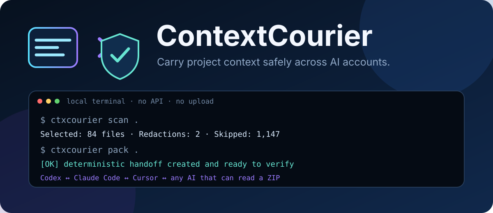

<p align="center">
  
</p>

<p align="center">
  <strong>本地运行 · 确定性产物 · 默认脱敏 · 不绑定 AI 厂商</strong><br>
  <a href="README.md">English</a> ·
  <a href="docs/ACCOUNT_SWITCHING.zh-CN.md">切换账号指南</a> ·
  <a href="docs/FORMAT.md">格式规范</a> ·
  <a href="SECURITY.md">安全策略</a>
</p>

# ContextCourier（上下文信使）

ContextCourier 会把软件项目生成一个可携带、已脱敏、可校验的上下文快照。你可以在
切换 ChatGPT/Codex 账号、改用 Claude Code 或 Cursor、或者把项目交给另一位 AI 编程
助手时使用它。

它不会读取桌面应用的私有数据库，也不会假装迁移服务器上的原始对话。它迁移的是你
能够安全控制和验证的内容：项目文件、Git 状态、任务文档、决策记录、完整性哈希以及
可直接给不同 AI 使用的导入说明。

## 最快用法

需要 Python 3.11+；建议安装 Git，以获得精确的仓库识别和忽略规则语义。没有任何
Python 运行时包依赖；如果没有 Git，ContextCourier 会明确提示并使用尽力而为的目录
扫描回退。

```powershell
# 从 GitHub Release 安装
python -m pip install "git+https://github.com/hbd20010918-cmd/ContextCourier.git@v0.1.0"

cd 你的项目目录

# 创建本项目的策略文件（建议）
ctxcourier init

# 先预览将包含、排除和脱敏的内容
ctxcourier scan .

# 生成上下文交接包
ctxcourier pack .

# 导入前校验每个文件的大小和 SHA-256
ctxcourier verify 你的项目名.contextcourier.zip
```

切换到新账号后，上传生成的 `.contextcourier.zip`，并发送下面这段话：

```text
请把这个 ContextCourier 压缩包当作只读的项目交接资料。先阅读 CONTEXT.md 和
MANIFEST.json，再使用 files/ 中已脱敏的项目快照。请保留已有项目状态和任务意图，
修改代码前先用当前工作区验证假设，不要尝试还原 CONTEXTCOURIER_REDACTED 标记的值。
```

详细步骤见[切换账号指南](docs/ACCOUNT_SWITCHING.zh-CN.md)。

## 它能保留什么

| 会放入交接包 | 明确不会迁移 |
|---|---|
| 精选项目文本和未提交工作文件 | ChatGPT/Codex 服务器上的原始对话 |
| README、AGENTS.md、任务和决策文档 | 账号、登录状态、订阅或账单信息 |
| Git 分支、提交与 dirty 状态 | Git 远程地址或其中可能存在的凭据 |
| 已脱敏的源码快照 | `.env`、私钥、认证数据库、应用会话 |
| 清单、SHA-256、脱敏报告、AI 适配说明 | 二进制、依赖目录、缓存和构建产物 |

旧账号仍然拥有它原来的私有任务；新账号不能直接打开那些任务。ContextCourier 的作用
是让新账号重新获得足够、清晰且可核验的**项目工作上下文**。

## 核心能力

- 全程本地执行，不需要 API Key，不上传仓库。
- 默认排除凭据容器、私钥、账号目录、二进制、依赖、缓存与构建产物。
- 在写入压缩包之前脱敏常见 OpenAI、GitHub、AWS、Google、Slack、Stripe、JWT、
  Authorization、URL 密码和通用密钥字段。
- 规范化 UTF-8/LF、排序和 ZIP 元数据；相同输入可生成相同字节。
- `MANIFEST.json` 记录所有条目的大小和 SHA-256。
- `verify` 拒绝路径穿越、重复文件、未知压缩、缺失文件和被篡改内容。
- 自动生成 `AGENTS.md`、`CLAUDE.md`、Cursor rule 和通用导入 Prompt。

## 常用安全选项

```powershell
# 只要发现需要脱敏的内容就中止，且不生成交接包
ctxcourier pack . --fail-on-secret

# 完全不包含未被 Git 跟踪的文件
ctxcourier pack . --tracked-only

# 调整边界
ctxcourier scan . --max-file-size 512KiB --max-total-size 10MiB --max-files 2000

# 供 CI 或脚本使用的 JSON 输出
ctxcourier verify project.contextcourier.zip --json
```

秘密检测是启发式安全层，不能保证发现所有自定义凭据。分享前仍应检查交接包；CI 中
建议使用 `--fail-on-secret`。详细边界见[威胁模型](docs/THREAT_MODEL.md)。

可配置边界不能超过 v1 的固定安全上限：单个源文件 8 MiB、原始源文件总量和打包后
文本总量各 48 MiB、最多 10,000 个入包文件、最多检查 100,000 个候选路径。归档与
清单还有独立的校验上限，详见[格式规范](docs/FORMAT.md)。

## 开发与贡献

```powershell
git clone https://github.com/hbd20010918-cmd/ContextCourier.git
cd ContextCourier
python -m pip install -e .
python -m unittest discover -s tests -v
python -m compileall -q src
```

欢迎提交 Issue 和 PR。请先阅读 [CONTRIBUTING.md](CONTRIBUTING.md) 和
[路线图](docs/ROADMAP.md)。测试只能使用代码动态拼接的假凭据，禁止提交真实密钥。

## 许可证

[MIT](LICENSE) © 2026 hbd20010918-cmd
